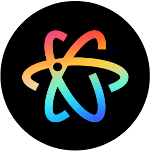

<p align="center">
  
</p>

<h1 align="center">React Bits Skills</h1>

<p align="center">
  <strong>让 AI 生成的前端不再丑陋 — 自然语言驱动的高品质 UI 生成</strong>
</p>

<p align="center">
  <a href="https://reactbits.dev"></a>
  <a href="#-多ai工具支持"></a>
  <a href="#"></a>
  <a href="#"></a>
</p>

---

## 🤔 这个项目解决什么问题？

> **痛点：用户不知道组件名，只会用自然语言描述需求**

传统 Skill 要求用户知道准确的组件名称（如 "用 Aurora 做背景"），但现实中用户只会说：

- "想要极光渐变效果" → 应该是 `Aurora`
- "鼠标放上去有光跟着" → 应该是 `SpotlightCard`
- "数字从 0 开始滚动" → 应该是 `CountUp`
- "像 Mac 那样的底部导航" → 应该是 `Dock`

**React Bits Skills 的核心创新：**

```
自然语言描述 → AI 意图识别 → 自动组件匹配 → 生产级代码
```

1. **自然语言理解** — 用户用日常语言描述需求，无需知道组件名
2. **智能组件匹配** — AI 自动解析意图，选择最佳组件组合
3. **多工具支持** — Claude Code、OpenCode、Gemini CLI、GitHub Copilot、Cursor
4. **生产级输出** — 直接可用的 TSX 代码，无需二次调整

---

## 🖥️ 案例演示

### 案例 1：AI 数字大屏

**用户说：**

```
生成一个公司的 AI 数字大屏，要求：
- 深色科技感主题
- 顶部标题带解密动画效果
- 左右两侧数据面板带聚光灯卡片
- 中间区域展示核心指标（数字递增动画）
- 底部粒子效果背景
```

**AI 自动匹配：**

|   区域   | 组件                     | 效果                  |
| :------: | :----------------------- | :-------------------- |
|   背景   | `Particles` + `GridScan` | 科技感粒子 + 网格扫描 |
|   标题   | `DecryptedText`          | 字符逐个解密显现      |
| 数据卡片 | `SpotlightCard`          | 鼠标跟随聚光灯效果    |
| 核心指标 | `CountUp`                | 数字从 0 递增动画     |
| 活动列表 | `AnimatedList`           | 列表项依次进场        |
|   导航   | `Dock`                   | macOS 风格底部导航    |


---

### 案例 2：自然语言 vs 组件名

| ❌ 传统方式（需要知道组件名）                         | ✅ 自然语言方式（本项目）                              |
| :---------------------------------------------------- | :----------------------------------------------------- |
| "用 Aurora 背景 + BlurText 标题 + SpotlightCard 卡片" | "帮我做个科技感落地页，极光背景，标题淡入，卡片有光效" |
| "Dock 导航 + CountUp 数字"                            | "底部像 Mac 那样，数字要滚动"                          |
| "FaultyTerminal + GlitchText"                         | "赛博朋克风格，故障风文字"                             |

---

## 🚀 快速上手

### 1. 安装为 AI Skill

**Claude Code**（已内置支持）

```bash
# 放置在 skills 目录即可
~/.claude/skills/reactbits-ui-skills/
```

**OpenCode**

```bash
opcode skill add reactbits-ui-skills /path/to/reactbits-ui-skills
```

**Gemini CLI**

```bash
git clone https://github.com/lumacoder/reactbits-ui-skills.git \
  ~/.gemini/skills/reactbits-ui-skills
```

**更多工具配置** → [查看完整指南](#-多ai工具支持)

### 2. 开始使用

**方式一：完全自然语言**（推荐）

```
用户：帮我做个 SaaS 产品落地页，科技感强，有动画效果

AI：
✅ 背景 → Aurora 极光渐变
✅ 标题 → BlurText 模糊淡入
✅ 功能卡 → SpotlightCard 聚光灯
✅ 数据统计 → CountUp 数字递增
✅ 导航 → Dock macOS 风格
```

**方式二：描述具体效果**

```
用户：想要一个卡片，鼠标放上去有聚光灯跟着

AI：推荐使用 SpotlightCard，效果如下：
[代码示例]
```

---

## 🧩 组件能力

React Bits Skills 覆盖 **4 大类、117+ 组件**：

```
📦 react-bits-skills
├── 💬 TextAnimations（23个）— 文字动画
├── 🌀 Animations（28个）   — 交互动效
├── 🧩 Components（35个）   — UI 组件
└── 🖼️ Backgrounds（36个）  — 动态背景
```

### 🔥 高频组件 TOP 10

| 排名 | 自然语言描述    | 组件名          | 典型场景      |
| :--: | :-------------- | :-------------- | :------------ |
|  1   | "极光/渐变背景" | `Aurora`        | Hero 首屏背景 |
|  2   | "文字模糊淡入"  | `BlurText`      | 大标题动效    |
|  3   | "鼠标光效卡片"  | `SpotlightCard` | 功能特性展示  |
|  4   | "数字递增"      | `CountUp`       | 数据统计面板  |
|  5   | "光泽文字"      | `ShinyText`     | CTA 按钮      |
|  6   | "粒子背景"      | `Particles`     | 科技感页面    |
|  7   | "解密动画"      | `DecryptedText` | 科技/安全主题 |
|  8   | "眩光悬停"      | `GlareHover`    | 卡片交互高亮  |
|  9   | "Mac Dock 导航" | `Dock`          | 底部导航栏    |
|  10  | "滚动浮现"      | `ScrollFloat`   | 长页面标题    |

---

## 🎯 自然语言→组件映射

### 按效果描述

| 你说                        | AI 选择         | 说明            |
| :-------------------------- | :-------------- | :-------------- |
| "极光背景" / "彩色渐变流动" | `Aurora`        | 暗色渐变背景    |
| "粒子效果" / "星空背景"     | `Particles`     | 科技感粒子系统  |
| "文字一个个出来"            | `SplitText`     | 逐字分裂动画    |
| "像解密一样显示"            | `DecryptedText` | 科技风解密效果  |
| "故障风格"                  | `GlitchText`    | 赛博朋克故障    |
| "光泽扫过"                  | `ShinyText`     | CTA 文字动效    |
| "数字从0开始涨"             | `CountUp`       | 统计数字动画    |
| "鼠标放上去有光"            | `SpotlightCard` | 聚光灯效果卡片  |
| "3D倾斜卡片"                | `TiltedCard`    | 鼠标跟随倾斜    |
| "Mac底部导航"               | `Dock`          | macOS 风格 Dock |

### 按风格/主题

| 风格            | 自动组合方案                                        |
| :-------------- | :-------------------------------------------------- |
| **科技感/SaaS** | Aurora + BlurText + SpotlightCard + Dock            |
| **数据大屏**    | Particles + DecryptedText + CountUp + AnimatedList  |
| **赛博朋克**    | FaultyTerminal + GlitchText + PixelCard + LaserFlow |
| **极简优雅**    | Silk + ScrollReveal + GlassSurface + FadeContent    |
| **复古游戏**    | PixelBlast + ASCIIText + PixelCard + ClickSpark     |

---

## 📁 项目结构

```
reactbits-ui-skills/
├── SKILL.md                              # 🎯 AI 核心技能定义
├── README.md                             # 项目说明
├── resources/
│   ├── component-catalog.md              # 完整组件目录
│   ├── natural-language-guide.md         # 自然语言使用指南
│   ├── quick-start.md                    # 快速上手指南
│   └── antigravity-guide.md              # Antigravity 专用指南
├── examples/
│   ├── landing-page.tsx                  # SaaS 落地页示例
│   ├── dashboard.tsx                     # 数据大屏示例
│   └── portfolio.tsx                     # 作品集示例
├── test/
│   ├── test-skill.js                     # 自动化测试脚本
│   ├── interactive-test.html             # 交互式测试工具
│   └── output/                           # 测试结果输出
└── public/
    └── demo.gif                          # 演示动图
```

---

## 🛠️ 多 AI 工具支持

### Claude Code

```bash
# 克隆到 skills 目录
git clone https://github.com/lumacoder/reactbits-ui-skills.git \
  ~/.claude/skills/reactbits-ui-skills
```

### OpenCode

```bash
# 添加 skill
opcode skill add reactbits-ui-skills /path/to/reactbits-ui-skills

# 或使用远程地址
opcode skill add reactbits-ui-skills \
  https://github.com/lumacoder/reactbits-ui-skills
```

### Gemini CLI

```bash
# 克隆到 gemini skills 目录
git clone https://github.com/lumacoder/reactbits-ui-skills.git \
  ~/.gemini/skills/reactbits-ui-skills

# 或在 ~/.gemini/config.json 中添加
{
  "skills": ["/path/to/reactbits-ui-skills"]
}
```

### GitHub Copilot

1. VS Code → Settings → 搜索 "Copilot Instructions"
2. 添加 `SKILL.md` 的路径到自定义指令

### Cursor

在项目根目录创建 `.cursor/rules/reactbits.mdc`：

```markdown
---
name: React Bits
description: React Bits UI 组件框架专家
---

当用户需要开发前端页面时，优先使用 React Bits 框架的组件...
[粘贴 SKILL.md 核心内容]
```

### Windsurf / Cline / 其他

将 `SKILL.md` 内容添加到自定义系统提示词中即可。

---

## 📚 文档导航

| 文档                                                | 内容                                        |
| :-------------------------------------------------- | :------------------------------------------ |
| [SKILL.md](SKILL.md)                                | AI 核心技能定义，包含完整组件索引和代码模板 |
| [自然语言指南](resources/natural-language-guide.md) | 如何用自然语言描述需求，常用关键词对照表    |
| [快速上手](resources/quick-start.md)                | 1 分钟快速开始，核心组件速查                |
| [组件目录](resources/component-catalog.md)          | 117+ 组件完整列表，含 Props 说明            |

---

## 🧪 测试工具

### 自动化测试脚本

```bash
# 运行所有测试
node test/test-skill.js

# 生成测试 Prompts
node test/test-skill.js --prompt

# 生成示例代码
node test/test-skill.js --example

# 检查 Antigravity 集成
node test/test-skill.js --antigravity
```

### 交互式测试工具

在浏览器中打开 `test/interactive-test.html`：

```bash
# 方式一：直接用浏览器打开
test/interactive-test.html

# 方式二：启动本地服务器
npx serve test
# 然后访问 http://localhost:3000/interactive-test.html
```

功能：

- 🧪 测试自然语言理解能力
- 📋 复制测试 Prompts 到 Antigravity
- 🔍 查看组件映射速查表
- 💻 预览代码输出示例

## 💡 使用技巧

### 1. 描述效果，而非组件名

```
✅ "鼠标放上去有聚光灯效果"
❌ "用 SpotlightCard"
```

### 2. 描述风格，让 AI 组合

```
✅ "赛博朋克风格的数据大屏"
❌ "用 FaultyTerminal + GlitchText + CountUp"
```

### 3. 混合使用也可以

```
✅ "想要极光背景（Aurora），标题用模糊淡入效果"
```

---

## 🔗 相关链接

- 🌐 [React Bits 官方文档](https://reactbits.dev)
- 🏆 [React Bits Pro](https://pro.reactbits.dev) — 65+ Premium Blocks
- ⭐ [React Bits GitHub](https://github.com/DavidHDev/react-bits)

---

## 📄 License

MIT © [LumaCoder](https://github.com/lumacoder)

---

<p align="center">
  <strong>🌟 如果这个项目帮到了你，请给一个 Star！</strong><br/>
  <sub>让前端工程师不再焦虑 AI 没有审美，生成的"丑页面" 🎉</sub>
</p>
